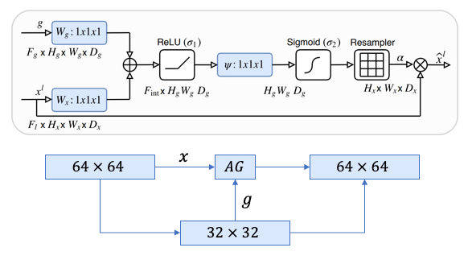
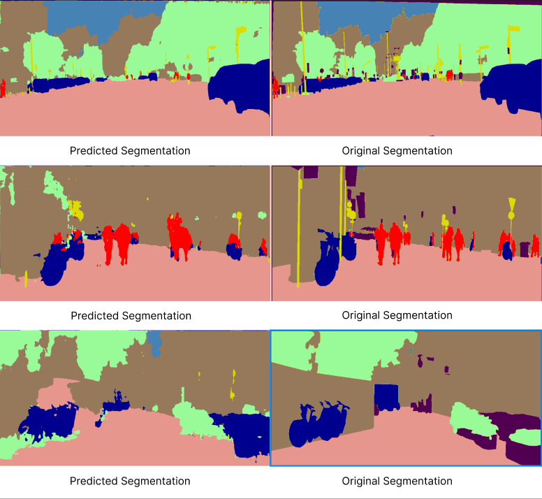

# CityScapes Semantic Segmentation 

## Introduction 

Semantic Segmentation plays a significant role in granular understanding of the visual scene, enabling vehicles to distinguish between `vehicles`,`people`,`traffic signs`,`buildings` etc. The resultant segmentation map is crucial for making decisions for navigation, lane-keeping, start and stop. 

## Dataset 

The cityscapes dataset consists of left windshield perspective or view of a car. The captured images are across different popular cities in Europe which encompasses different landscapes, thereby contributing to the diversity of the dataset. 

TRAIN_CITIES = monchengladbach, krefeld, cologne, jena, bochum, hamburg, dusseldorf, ulm, bremen, stuttgart, strasbourg, weimar, erfurt, darmstadt, zurich, tubingen, aachen & hanover

VAL_CITIES = frankfurt, munster & lindau

## Model Architecture 

Original Image Size : `1024 x 2048`

Resized Image Size : `512 x 1024` 

Aspect Ratio of `1:2` must be preserved. 

### U-Net Model

### Attention U-Net Model 

## Performance Metrics 

loss function : `Cross Entropy`

| Model | Batch Size | Pixel Accuracy | Mean IOU | Convergence Epoch |
|----------|----------|----------|----------|----------|
| Simple-U-Net | 2 | 87.04 | 60.17 | 26 |
| Attention U-Net | 2 | 86.88 | 60.19 | 15 |

    <figure style="margin: 0; padding: 0;">
    
    <figcaption>Attention U-Net</figcaption>
    </figure>
    <figure style="margin: 0; padding: 0;">
    
    <figcaption>Simple U-Net</figcaption>
    </figure>

### Results and Analysis

- U-Net model benefits by incorporating attention module, this can be clearly witnessed as the attention-u-net model converges quicker than its counterpart. 
- Observing the visualization, Attention Module helps improve the sharpness, precision and produces a well-defined shape of semantics. The predictions are more precise in the boundary regions of semantics. 
- Both the model's perforrmance saturate at `mean_iou ~ 61%`. In order to maximize the performance 
    - must increase batch_size. Currently, trying to procure a bigger GPU machine. 
    - Including residual connections within the encoder modules. This facilitates gradient propogation to the earlier layers. Solves the problem of vanishing gradients. 