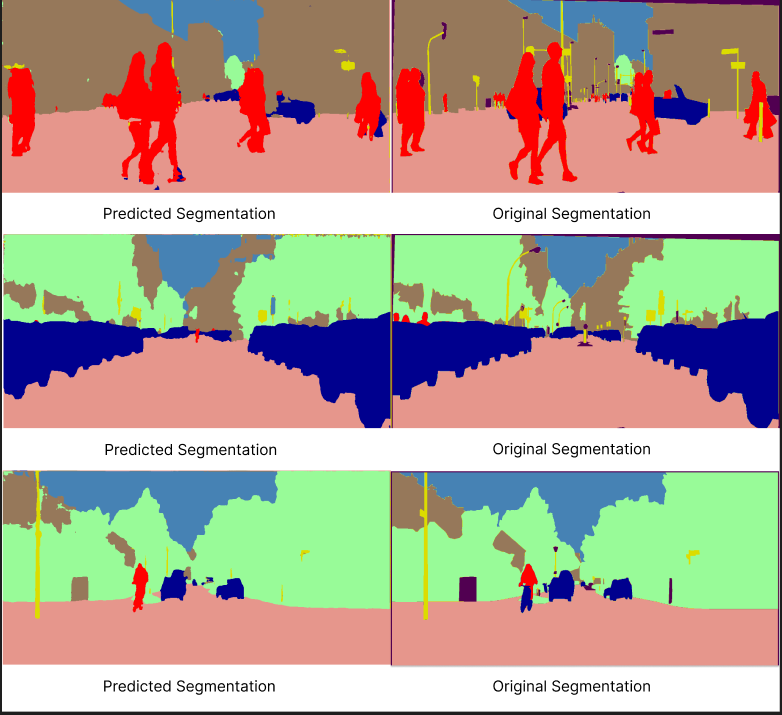
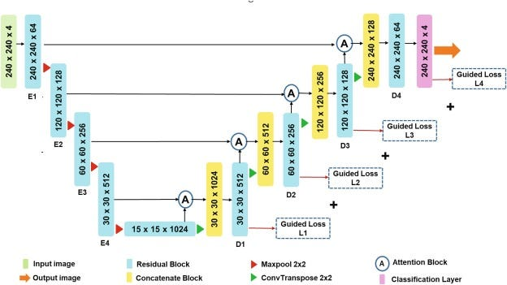
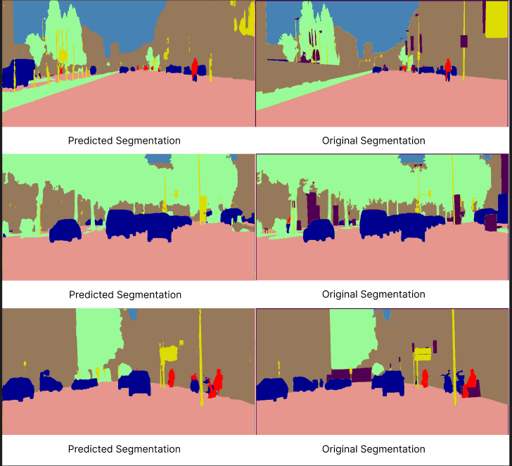

# CityScapes Semantic Segmentation 

## Introduction 

Semantic Segmentation plays a significant role in granular understanding of the visual scene, enabling vehicles to distinguish between `vehicles`,`people`,`traffic signs`,`buildings` etc. The resultant segmentation map is crucial for making decisions for navigation, lane-keeping, start and stop. 

## Dataset 

The cityscapes dataset consists of left windshield perspective or view of a car. The captured images are across different popular cities in Europe which encompasses different landscapes, thereby contributing to the diversity of the dataset. 

TRAIN_CITIES = monchengladbach, krefeld, cologne, jena, bochum, hamburg, dusseldorf, ulm, bremen, stuttgart, strasbourg, weimar, erfurt, darmstadt, zurich, tubingen, aachen & hanover

VAL_CITIES = frankfurt, munster & lindau

## Model Architecture 

Original Image Size : `1024 x 2048`

Resized Image Size : `512 x 1024` 

Aspect Ratio of `1:2` must be preserved. 

### U-Net Model

### Attention U-Net Model 

## Performance Metrics 

loss function : `Cross Entropy`

| Model | Batch Size | Pixel Accuracy | Mean IOU | Convergence Epoch |
|----------|----------|----------|----------|----------|
| Simple-U-Net | 2 | 87.04 | 60.17 | 26 |
| Attention U-Net | 2 | 86.88 | 60.19 | 15 |
| Resnet Attention U-Net | 2 | 86.88 | 64.50 | 14 |

    <figure style="margin: 0; padding: 0;">
    
    <figcaption>Attention U-Net</figcaption>
    </figure>
    <figure style="margin: 0; padding: 0;">
    
    <figcaption>Simple U-Net</figcaption>
    <figure style="margin: 0; padding: 0;">
    
    <figcaption>Resnet-Attention-U-Net-Visual</figcaption>    
    </figure>

### Results and Analysis

|  | Resnet-Attention-UNet | Attention-UNet | Simple UNet | 
|----------|----------|----------|----------
| Convergence| Fastest Convergence and attains highest IOU, saturate at `mean_iou ~ 65%`.| Converges faster than Simple U-Net, saturate at `mean_iou ~ 61%`.| Slowest Convergence, saturate at `mean_iou ~ 61%`. | 
| Observation through Visualization| Residual Connection refine the shape definations. The shape of vehicles are more sharper than Attention U-Net. Hallucinations of certain shapes is observed. (Top-Left) | Attention Module helps improve the sharpness, precision and produces a well-defined shape of semantics. The predictions are more precise in the boundary regions of semantics. | Model lacks in defination and sharpness around boundaries. In some cases the shape of the prediction is not even remotely retained.| 

##### Improvements to Work-On
- Procure larger GPU to increase `batch_size`. 
- Apply custom loss function to improve confidence in class predictions `accuracy` and `IOU`.
- Implement custom weighted loss function to combine `cross_entropy` and `iou_loss`. 